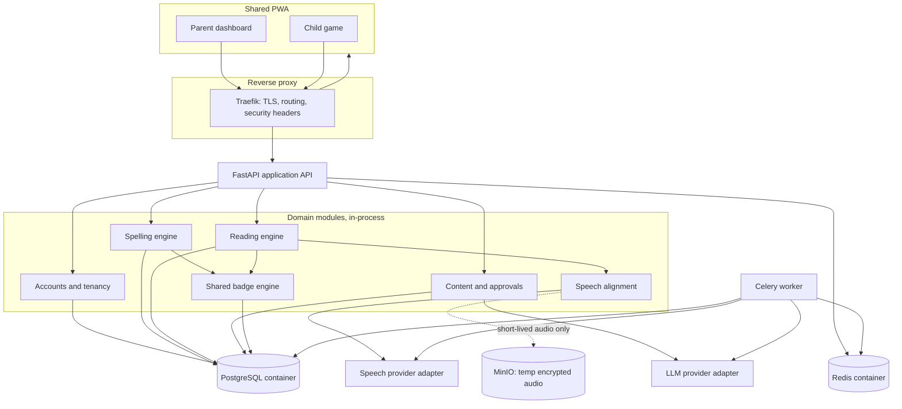
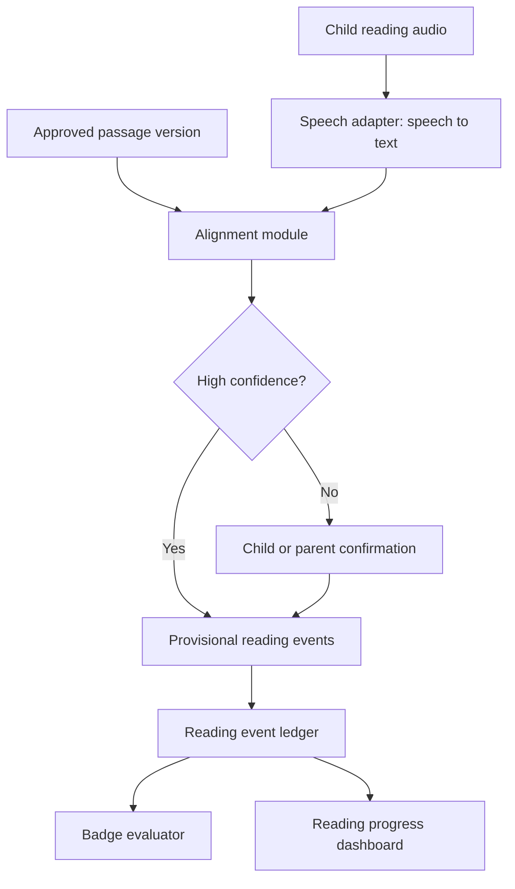
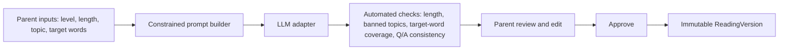
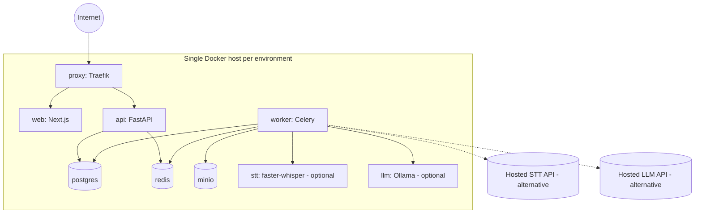

# Architecture Design - LumaQuest Suite (Reading Quest)

**Status:** Proposed
**Scope:** Shared platform architecture (accounts, tenancy, badges, delivery) plus the Reading Quest domain module. Spelling Quest is the first tenant of this same platform; nothing here is specific to Reading Quest unless stated.
**Source requirements:** `docs/Reading_Quest_PRD_and_Delivery_Plan.md`, `docs/Spelling_Quest_PRD_and_Delivery_Plan.md`

## 1. Executive summary

LumaQuest Suite is a modular monolith serving two learning games — Spelling Quest and Reading Quest — from one backend, one database, and one parent/child web client. Reading Quest is added as a new domain module that reuses the platform's family accounts, child profiles, session infrastructure, and badge engine, and introduces its own passage-authoring workflow, speech-alignment pipeline, hint ladder, comprehension engine, and reread scheduler.

Key decisions made in this document:

- **Container-first deployment.** Every runtime component (web, API, worker, database, cache, object storage, reverse proxy) ships as an OCI container and is orchestrated with Docker Compose. This keeps environments identical from a laptop to production and avoids coupling the design to one cloud vendor's managed services.
- **Python/FastAPI for the API.** Chosen over the Node/TypeScript alternative considered in the Spelling Quest PRD so the team can share one language across the API, the background worker, and the speech/LLM adapters.
- **Speech and LLM behind adapters, not baked in.** Both games treat speech-to-text and generative text as untrusted, replaceable providers behind a stable internal interface — self-hosted (containerized) or hosted, swappable without touching domain logic.
- **One tenancy boundary, two learning models.** Spelling and Reading share `Family`, `ChildProfile`, and the badge engine, but keep separate progress/mastery models — a child is never reduced to one blended "level."

## 2. System overview

### 2.1 Component diagram

### 2.2 Technology stack

| Layer | Technology | Rationale |
|---|---|---|
| Client | Next.js (React, TypeScript), installable PWA | Shared parent dashboard and child game; SSR helps first-load performance on home connections |
| API | Python 3.12, FastAPI, Pydantic v2 | Requested language; async support suits speech/LLM I/O; Pydantic doubles as the request/response contract |
| ORM & migrations | SQLAlchemy 2.0, Alembic | Mature, explicit migrations; works well with the modular-monolith table layout |
| Background worker | Celery + Redis broker | Runs speech transcription orchestration, LLM generation, reread scheduling, and report aggregation off the request path |
| Database | PostgreSQL 16 (container, persistent volume) | One physical database; family-scoped tenancy at the query layer; ACID guarantees for reward/badge ledgers |
| Cache / broker | Redis (container) | Celery broker + result backend, session/rate-limit store, hot-path caching (today's plan, badge catalog) |
| Object storage | MinIO (container, S3-compatible API) | Short-lived encrypted audio only, when a provider requires object storage instead of a direct stream; swappable for a managed bucket via the same S3 API |
| Reverse proxy | Traefik (container) | TLS termination (ACME/Let's Encrypt), routing to web/API containers, security headers, per-route rate limits |
| Speech adapter | Pluggable interface; self-hosted `faster-whisper` container or a hosted STT API | Same interface for both games; hosted for accuracy, self-hosted to keep the "everything is a container" property and avoid per-utterance cost |
| LLM adapter | Pluggable interface; self-hosted model (e.g., an Ollama container) or a hosted API | Used only in the parent-facing content-generation workflow, never in a live child session |
| Orchestration | Docker Compose (single-host per environment) | Matches team size and MVP scale; documented upgrade path to Swarm/Kubernetes if a single host becomes insufficient |
| Observability | Structured JSON logs, Prometheus + Grafana + Loki (containers) or a hosted log/error sink | Provider latency, error rates, and request correlation; never raw audio or secrets |

### 2.3 Architecture pattern

A **modular monolith**: one FastAPI application and one Celery worker, both built from the same Python packages, with clear module boundaries (`accounts`, `spelling`, `reading`, `alignment`, `content`, `badges`). Modules communicate through in-process function calls and a shared domain event log, not network calls. This keeps operational overhead low for two games and a small team while leaving a clean seam to extract a module into its own service later if load ever requires it (most likely the speech/alignment path, since it is the heaviest I/O).

## 3. Application architecture

### 3.1 Component design

| Component | Responsibility | Notes |
|---|---|---|
| Web client (`apps/web`) | Parent dashboard, child game shell, microphone capture, offline shell, accessibility (focus mode, dyslexia-friendly type, reduced motion) | One PWA serves both games; game-specific screens are route-level code-split |
| API (`apps/api`) | AuthN/AuthZ, request validation, orchestration, synchronous scoring, tenancy enforcement | FastAPI routers per domain module, one OpenAPI schema |
| Accounts module | Family accounts, child profiles, preferences, sessions | Shared by both games; no child credentials |
| Spelling engine (`packages/spelling-engine`) | Weekly list scheduling, mastery scoring, retry spacing | Pure domain logic, deterministic, unit-testable without I/O |
| Reading engine (`packages/reading-engine`) | Passage/word-set lifecycle, target-word selection, hint ladder, reread scheduling | Pure domain logic where possible; calls alignment/content modules for evidence |
| Speech alignment (`packages/reading-aligner`, `packages/answer-normalizer`) | Normalizes transcripts, aligns them to expected text/letters, classifies events, applies confidence thresholds | Shared normalization primitives; reading-specific sequence alignment |
| Content & approvals (`packages/content-generation`) | LLM prompt construction, automated content checks, versioning, approval workflow | Runs in the parent workflow, never in the child session path |
| Badge engine (`packages/badge-engine`) | Evaluates badge criteria, awards idempotently, manages the reward ledger | One catalog and one evaluator for both games' events |
| Worker | Executes long-running or bursty work off the request path | Transcription calls, LLM generation, weekly/aggregate badge re-evaluation, reread-due batch job, report aggregation |
| Speech adapter (`packages/speech-adapter`) | Uniform interface over STT/TTS providers; normalizes provider-specific confidence scores | Implementations: self-hosted `faster-whisper`, hosted STT API |
| Contracts (`packages/contracts`) | Shared Pydantic/TypeScript-generated types for API requests/responses | Generated once, consumed by both `apps/web` and `apps/api` to avoid drift |

### 3.2 API design

- **Style:** REST over HTTPS, JSON bodies, versioned under `/api/v1`.
- **AuthN:** Parent accounts authenticate with email + password (Argon2 hashing) or a magic link; the API issues a short-lived session via an httpOnly, secure, `SameSite=Lax` cookie backed by a Redis session store. Children do not authenticate independently — a parent's authenticated session selects an active child profile.
- **AuthZ:** Every request resolves to a `family_id`; a shared dependency/middleware injects and enforces that scope on every query. No handler is allowed to query without it.
- **Idempotency:** Mutating endpoints that can be retried by a flaky client (attempt submission, badge-triggering events) accept an idempotency key or rely on natural unique constraints (e.g., `(child_id, badge_id)`).

Consolidated endpoint groups:

| Group | Method and route | Purpose |
|---|---|---|
| Accounts | `POST /api/v1/auth/session` | Create a parent session |
| Accounts | `GET /api/v1/children` / `POST /api/v1/children` | List / create child profiles |
| Spelling | `POST /api/v1/word-lists`, `PATCH /api/v1/word-lists/{id}` | Create and edit a weekly list |
| Spelling | `GET /api/v1/children/{id}/today` | Today's spelling practice plan |
| Spelling | `POST /api/v1/practice-sessions`, `POST /api/v1/practice-sessions/{id}/attempts`, `POST /api/v1/practice-sessions/{id}/complete` | Run a spelling session |
| Spelling | `POST /api/v1/speech/transcribe` | Transcribe a short spelling utterance |
| Spelling | `GET /api/v1/children/{id}/progress` | Spelling dashboard data |
| Reading | `POST /api/v1/reading-items`, `POST /api/v1/reading-items/{id}/generate` | Create/generate reading content |
| Reading | `POST /api/v1/reading-versions/{id}/approve` | Freeze and approve a version |
| Reading | `POST /api/v1/reading-assignments` | Assign approved content to a child |
| Reading | `GET /api/v1/children/{id}/reading/today` | Today's reading plan |
| Reading | `POST /api/v1/reading-sessions`, `POST /api/v1/reading-sessions/{id}/audio`, `POST /api/v1/reading-sessions/{id}/events`, `POST /api/v1/reading-sessions/{id}/answers`, `POST /api/v1/reading-sessions/{id}/complete` | Run a reading session |
| Reading | `GET /api/v1/children/{id}/reading/progress` | Reading dashboard data |
| Badges | `GET /api/v1/badges`, `GET /api/v1/children/{id}/badges` | Catalog and earned/progress badges (shared across both games) |

### 3.3 Data flow: reading session

### 3.4 Data flow: content generation

## 4. Data architecture

### 4.1 Database design

Single PostgreSQL 16 database, one schema, tables grouped by domain and prefixed accordingly. Every row that is child- or family-specific carries `family_id` (directly or transitively through a foreign key), and every query path goes through the tenancy dependency described in §3.2. Row-level security policies mirroring the application-level scope are a candidate hardening step (see §12) but are not required for MVP given the enforced middleware.

### 4.2 Data models

**Shared platform**

| Entity | Important fields | Notes |
|---|---|---|
| `Family` | `id`, `owner_user_id`, `timezone` | Security boundary for all child data |
| `ChildProfile` | `id`, `family_id`, `display_name`, `grade_band`, `preferences` | Shared by both games; no public profile |
| `RewardLedger` | `child_id`, `event_type`, `points`, `metadata` | Append-only; both games write to it |
| `BadgeDefinition` | `id`, `code`, `name`, `description`, `category`, `tier`, `icon_key`, `criteria`, `is_secret` | One catalog, spelling and reading badges both present |
| `ChildBadge` | `child_id`, `badge_id`, `earned_at`, `progress`, `source_event_id` | Unique `(child_id, badge_id)` prevents duplicate awards |

**Spelling domain**

| Entity | Important fields | Notes |
|---|---|---|
| `WordList` | `id`, `child_id`, `title`, `start_date`, `test_date`, `status` | |
| `Word` | `id`, `list_id`, `text`, `sentence`, `position` | |
| `WordProgress` | `child_id`, `word_id`, `stage`, `mastery_score`, `next_due_at` | Rebuildable from `Attempt` history |
| `PracticeSession` | `id`, `child_id`, `started_at`, `ended_at`, `plan_snapshot` | |
| `Attempt` | `session_id`, `word_id`, `mode`, `response`, `result`, `confidence`, `timestamp` | |

**Reading domain**

| Entity | Important fields | Notes |
|---|---|---|
| `ReadingItem` | `id`, `family_id`, `type`, `title`, `source`, `status`, `created_by` | Parent-owned content record |
| `ReadingVersion` | `id`, `item_id`, `text`, `level_config`, `approval_status`, `created_at` | Immutable once approved |
| `TargetWord` | `version_id`, `word`, `position`, `phonics_tags`, `priority` | |
| `ReadingAssignment` | `id`, `child_id`, `version_id`, `scheduled_at`, `status` | |
| `ReadingSession` | `id`, `assignment_id`, `started_at`, `completed_at`, `mode` | |
| `ReadingEvent` | `session_id`, `token_position`, `event_type`, `observed_text`, `confidence`, `hint_level` | Detailed aligned evidence |
| `Question` | `version_id`, `type`, `prompt`, `choices`, `expected_answer`, `source_span` | Approved with the passage |
| `QuestionAttempt` | `session_id`, `question_id`, `response`, `result`, `support_used` | |
| `BookLog` | `child_id`, `title`, `author`, `start_date`, `finish_date`, `page_progress` | No copyrighted text stored |

### 4.3 Caching strategy

| What | Where | TTL / invalidation |
|---|---|---|
| Parent session | Redis | Sliding expiry on activity; revoked on logout/password change |
| Today's plan (spelling and reading) | Redis, keyed by `child_id` + date | Invalidated on session completion or content re-assignment |
| Badge catalog | Redis, in-process fallback | Invalidated on catalog deploy/version bump |
| Rate-limit counters (auth, generation, speech) | Redis | Fixed window, short TTL |

### 4.4 Data migration strategy

Alembic manages all schema changes; migrations are additive-first (new nullable columns/tables before backfills) to keep rolling deploys safe with a single-host, brief-downtime deploy model. `ReadingVersion` and `Attempt`/`ReadingEvent` rows are immutable once written — corrections are new rows referencing the original (`parent_corrected` event type, or a new `ReadingVersion`), never in-place mutation, preserving audit history required by §5 and ADR-007/ADR-011.

## 5. Security architecture

### 5.1 Authentication & authorization

- Parent-owned accounts only; children never hold credentials (ADR-006). A child is a sub-resource selected within an authenticated parent session.
- Passwords hashed with Argon2id; sessions are opaque tokens in Redis, referenced by an httpOnly/secure cookie — not a long-lived JWT, so a session can be revoked server-side immediately.
- Every data-access function requires an explicit `family_id` scope, enforced by a shared FastAPI dependency; there is no code path that queries `ChildProfile`, `WordList`, `ReadingItem`, etc., without it. This is verified by integration tests per game (see PRDs' "Definition of done").

### 5.2 Data protection

- TLS terminated at the Traefik reverse proxy (ACME-issued certificates); internal container-to-container traffic stays on a private Docker network not reachable from outside the host.
- PostgreSQL and MinIO volumes are encrypted at the disk/volume level (host-level LUKS or the cloud block-storage provider's encryption, depending on where the container host runs).
- Temporary audio objects in MinIO use server-side encryption and a lifecycle rule that deletes them automatically; no raw audio is retained by default in either game (ADR-005, ADR-014). A parent may opt into retaining specific reading recordings for private comparison, stored with the same encryption and an explicit deletion control.

### 5.3 Input validation

- All request/response bodies are Pydantic models; FastAPI rejects anything that doesn't validate before it reaches domain logic.
- LLM-generated content never reaches a child directly: it passes automated checks (length, banned topics, target-word coverage, question/answer consistency) and then mandatory parent review/edit before approval (ADR-011).
- Speech-derived text is treated as untrusted evidence, not a direct write: it is normalized, confidence-scored, and low-confidence spans are excluded from automatic negative scoring (ADR-009).

### 5.4 Security headers & compliance

- Traefik/API set standard headers: `Strict-Transport-Security`, `X-Content-Type-Options`, `X-Frame-Options`/frame-ancestors CSP, and a CSP restricting script/style origins to the app's own bundles.
- CORS restricted to the deployed PWA origin(s) per environment.
- Product posture is COPPA-aware by design: minimal data collection, display names over legal names, no ads/behavioral profiling/public rankings, export and deletion controls per family. Legal review is still required before broad marketing to children or schools, per both PRDs.

### 5.5 Secrets management

Secrets (DB credentials, Redis URL, provider API keys, session signing key) are injected as environment variables from Docker Compose secrets / an environment file outside version control, distinct per environment. No secret is baked into a container image or committed to the repository.

## 6. Infrastructure architecture

### 6.1 Compute strategy — containers everywhere

Every runtime component ships as an OCI image and runs as a container: `web`, `api`, `worker`, `postgres`, `redis`, `minio`, `proxy`, plus an optional self-hosted `stt` (`faster-whisper`) and `llm` (e.g., Ollama) container. Docker Compose defines one stack per environment (`dev`, `staging`, `prod`), each on its own Docker network, so environments are structurally identical and the only differences are environment variables, resource limits, and replica counts.

### 6.2 Networking

- One private Docker bridge network per environment; only the `proxy` container publishes ports (80/443) to the host.
- `postgres`, `redis`, and `minio` are not published to the host at all — reachable only from `api`/`worker` on the internal network.
- Host firewall allows inbound 443 (and 80 for ACME/redirect) and an admin SSH port restricted to known IPs; everything else is closed.
- DNS points at the host (or a load balancer in front of it); Traefik handles certificate issuance/renewal via ACME.

### 6.3 Deployment pipeline

1. CI builds `web`, `api`, and `worker` images on merge to `main` and tags them with the commit SHA.
2. Images are pushed to a container registry (e.g., GHCR).
3. A deploy step updates the target environment's Compose file image tags and runs `docker compose pull && docker compose up -d`, which recreates only the changed containers.
4. Database migrations run as a one-off container (`docker compose run --rm api alembic upgrade head`) before the new `api`/`worker` containers start.
5. Staging mirrors production's Compose stack at smaller resource limits; it is the required gate before a production deploy.

### 6.4 Environment strategy

Three environments (`dev`, `staging`, `prod`), each its own Compose stack (and, for prod, ideally its own host or at minimum its own resource-isolated network) with its own database, secrets, and provider credentials — no shared state between them. `dev` may run STT/LLM entirely self-hosted to avoid cost/quota during iteration; `staging`/`prod` can switch either adapter to the hosted provider via configuration only.

## 7. Scalability & performance

### 7.1 Scaling strategy

- `web`, `api`, and `worker` are stateless and can run multiple replicas behind Traefik (`docker compose up --scale api=3`) without code changes.
- `postgres` is the first bottleneck at scale: MVP runs it as a single container with a persistent volume; the documented path when a single instance is no longer enough is to move to a managed Postgres service with read replicas, without changing the data model (the ORM layer is the only thing that would need a connection-string change).
- `redis` and `minio` follow the same pattern — single-container for MVP, clustered/managed when load requires it.
- Heavy or bursty work (transcription, LLM generation, aggregate badge re-evaluation, reread-due scans) always goes through the Celery worker, keeping the API's own latency budget protected from provider slowness.

### 7.2 Performance optimization

- Today's plan (spelling and reading) is cached per child/day in Redis to hit the PRDs' 2-second p95 load target without recomputing scheduling logic on every request.
- Speech segments are processed in short chunks (sentence-sized) to hit the 3–4 second p95 latency targets; the worker streams partial results back to the client rather than waiting for a full-passage transcript.
- Database access is scoped and indexed by `family_id`/`child_id` first, since every query already filters on tenancy.

### 7.3 Load testing plan

Before public release, load-test: (1) concurrent session starts around the after-school peak window, (2) burst LLM generation requests during a simulated "many parents planning Sunday night" pattern, and (3) STT throughput on the worker under concurrent reading sessions. Use these results to size container CPU/memory limits and decide the first scale-out trigger (replica count vs. moving Postgres to a managed instance).

## 8. Reliability & availability

### 8.1 High availability design

MVP intentionally accepts a single-host deployment as a documented trade-off for operational simplicity (Spelling Quest PRD's 99.5% monthly target reflects this). The main single point of failure is the host itself; mitigation is fast, scripted recovery (redeploy the Compose stack from the registry + restore the latest Postgres/MinIO backup) rather than active-active failover, which is deferred until usage justifies the added complexity (see §12).

### 8.2 Disaster recovery

- `postgres`: nightly `pg_dump` (or WAL archiving for point-in-time recovery) to encrypted off-host storage, with a documented restore runbook and a periodic restore drill.
- `minio`: irrelevant to long-term backup by design — it only ever holds short-lived, auto-expiring audio objects.
- Container images and Compose/Alembic definitions are the source of truth for "how to rebuild the host"; a fresh host should be reconstructible from the registry + latest backup within a documented RTO.

### 8.3 Monitoring & alerting

- Structured JSON logs from every container, correlated by request ID, shipped to either a self-hosted Loki/Grafana stack (containers, consistent with §6.1) or a hosted log sink.
- Prometheus scrapes API/worker metrics (request latency, provider call latency/error rate, queue depth); Grafana dashboards and alert rules cover error-rate spikes, queue backlog, and disk/volume pressure on `postgres`.
- Error tracking via Sentry or a self-hostable equivalent (e.g., GlitchTip, also a container) — never logs raw audio, transcripts, or full child responses, only error context and IDs.
- Uptime/synthetic check against the public health endpoint.

## 9. Cost analysis

Costs below are rough MVP-scale planning figures (a few dozen to a few hundred families), not a scaled-usage forecast.

### 9.1 Infrastructure costs

| Item | Estimate | Notes |
|---|---|---|
| Container host (prod), e.g. 4 vCPU / 8 GB VM | ~$40–80/month | Runs proxy, web, api, worker, postgres, redis, minio |
| Staging host (smaller) | ~$20–40/month | Can be scaled down/stopped outside active development |
| Off-host backup storage | ~$5–15/month | Encrypted `pg_dump`/WAL archives |
| Domain + TLS | ~$1–2/month | ACME certificates are free; domain registration is the main cost |

### 9.2 Operational costs

| Item | Estimate | Notes |
|---|---|---|
| Hosted STT (if chosen over self-hosted) | Usage-based, roughly cents per session | Only for the hosted adapter implementation; self-hosted `faster-whisper` trades this for host CPU |
| Hosted LLM (if chosen over self-hosted) | Usage-based, per generation request | Only invoked in the parent content-authoring flow, not per child session, which keeps volume low |
| Error tracking / log hosting (if using a SaaS tier) | $0–30/month | Free tiers are usually sufficient at MVP scale |

### 9.3 Cost optimization

- Prefer self-hosted `faster-whisper`/Ollama containers while usage is low and predictable; switch the relevant adapter to a hosted provider only where self-hosted accuracy or host CPU becomes the limiting factor — the adapter boundary makes this a configuration change, not a rewrite.
- Keep `dev`/`staging` hosts small and able to scale to zero outside active work.
- Because LLM generation only happens in the parent workflow (not per child session), its cost scales with content authored, not with daily play — the natural bottleneck stays cheap.

## 10. Architecture decision records

### ADR-001: Responsive PWA before native mobile apps

**Status:** Accepted
**Context:** The product needs to reach families on whatever device they have, quickly, without app-store review cycles.
**Decision:** Build one responsive, installable PWA for both parent and child experiences; no native app for MVP.
**Consequences:** Faster iteration and a single codebase; some native capabilities (deep OS integration) are unavailable until/unless a native wrapper is added later.

### ADR-002: Modular monolith for MVP

**Status:** Accepted
**Context:** Two games share most of their platform needs; a microservices split would add operational cost without a corresponding scale requirement yet.
**Decision:** One deployable API and one worker, organized into internal modules (`accounts`, `spelling`, `reading`, `alignment`, `content`, `badges`) with clear boundaries.
**Consequences:** Lower operational overhead and simpler transactions across shared tables; module boundaries must be kept clean (no reaching into another module's tables directly) so a future extraction stays possible.

### ADR-003: Exact deterministic scoring outside the LLM (spelling)

**Status:** Accepted
**Context:** Spelling correctness is an exact-match problem; an LLM is unnecessary and non-deterministic for the core scoring path.
**Decision:** Score spelling attempts via STT → normalization → exact comparison. LLM use is limited to optional, feature-flagged assistance (example sentences, hints, ambiguous-phrase parsing), never the scoring decision.
**Consequences:** Deterministic, testable, reproducible results; any LLM assistance must be clearly separated from the scoring pipeline in code and in the UI.

### ADR-004: Pluggable speech provider interface

**Status:** Accepted
**Context:** Neither game should be locked to one STT/TTS vendor, and both need a self-hosted option to keep the container-only deployment story intact.
**Decision:** Define one `speech-adapter` interface consumed by both games; ship at least a self-hosted (`faster-whisper`) and a hosted-API implementation behind it.
**Consequences:** Provider swaps are a configuration change; new provider quirks are isolated to one adapter implementation instead of leaking into domain logic.

### ADR-005: No raw audio retention by default

**Status:** Accepted
**Context:** Child speech is sensitive; minimizing retention reduces privacy risk and regulatory exposure.
**Decision:** Audio is processed in memory or short-lived encrypted object storage and deleted automatically; nothing is retained by default in either game.
**Consequences:** Debugging provider issues after the fact is harder without recordings; mitigated by capturing confidence scores, alignment events, and non-audio diagnostics instead.

### ADR-006: Parent-owned accounts and child subprofiles

**Status:** Accepted
**Context:** Children should not need independent credentials or discoverable identities.
**Decision:** Only parents authenticate; child profiles are sub-resources selected within an authenticated parent session.
**Consequences:** Simpler child-safety posture and no child credential-recovery flow to build; every child action must be attributed to the active profile within the parent's session, enforced server-side.

### ADR-007: Immutable attempt history with auditable corrections

**Status:** Accepted
**Context:** Trust in progress data requires knowing what actually happened, even after a parent correction.
**Decision:** `Attempt`/`ReadingEvent` rows are never mutated; a correction is a new event referencing the original.
**Consequences:** Slightly more storage and query complexity (must resolve "current" vs. "original") in exchange for a full, auditable history.

### ADR-008: Reading Quest is a shared-platform domain, not a separate application

**Status:** Accepted
**Context:** Reading Quest reuses nearly all of Spelling Quest's platform (accounts, tenancy, badges, delivery infrastructure).
**Decision:** Add Reading Quest as new modules and tables inside the same monolith and database rather than standing up a second application/stack.
**Consequences:** No duplicated auth/tenancy/badge code; a feature flag/permission model is required so a family can have one game enabled without the other, and disabling one must not affect the other's data or behavior.

### ADR-009: Speech results are provisional until confidence rules accept them

**Status:** Accepted
**Context:** Child reading speech is harder to recognize reliably than isolated spelling utterances (accents, pauses, self-corrections, quiet speech).
**Decision:** Treat every STT-derived alignment event as provisional; low-confidence spans require child/parent confirmation before they count as errors.
**Consequences:** Slightly more UI friction (a confirmation step) in exchange for materially fewer false negative reading events; confidence thresholds become a tunable, tracked parameter.

### ADR-010: Fluency is not reduced to reading speed

**Status:** Accepted
**Context:** Optimizing purely for words-per-minute would encourage rushing and reduce comprehension, undermining the product's actual goal.
**Decision:** Fluency evidence combines accuracy, support level used, and reread improvement; words-correct-per-minute is shown to parents only as supporting context, never as the primary child-facing metric.
**Consequences:** The scoring/progress model is more nuanced (multiple weighted signals) than a single speed number, but better matches the pedagogical goal.

### ADR-011: Generated child content requires parent approval and versioning

**Status:** Accepted
**Context:** LLM-generated passages/questions could be inaccurate, off-topic, or mismatched to the target words if shown to a child unreviewed.
**Decision:** All generated content passes automated checks, then mandatory parent review/edit, then is frozen as an immutable `ReadingVersion` before any assignment.
**Consequences:** No child ever sees unreviewed generated content; content authoring has an extra step, and prompt/model changes can never retroactively alter an already-approved version.

### ADR-012: Hint level is part of mastery evidence

**Status:** Accepted
**Context:** A word only read after being told outright is not evidence of independent reading ability.
**Decision:** Every reading event records the hint level used; only independently-read words count toward independent-mastery evidence and related badges.
**Consequences:** Slightly more granular event schema (`hint_level` on every `ReadingEvent`), but prevents badge/progress inflation from heavily supported reads.

### ADR-013: Reading and spelling share badges but retain separate learning models

**Status:** Accepted
**Context:** A unified badge collection is motivating and simple for families, but blending the two games' progress math would produce a misleading combined "level."
**Decision:** One `BadgeDefinition`/`ChildBadge`/`RewardLedger` schema serves both games via `event_type`; `WordProgress` (spelling) and reading's event/session tables remain entirely separate models.
**Consequences:** One badge UI and evaluator to build and test; badge criteria authors must be explicit about which game's events satisfy which badge.

### ADR-014: Raw reading audio is not retained by default

**Status:** Accepted
**Context:** Same rationale as ADR-005, restated for Reading Quest specifically because reading sessions capture longer audio segments than spelling utterances and add an explicit opt-in retention feature.
**Decision:** No raw reading audio is retained by default; a parent may opt into retaining specific recordings for private comparison, with visible deletion controls.
**Consequences:** The opt-in retention path needs its own encrypted storage, consent record, and deletion flow, kept separate from the default (non-retained) path.

### ADR-015: All services deploy as OCI containers orchestrated with Docker Compose

**Status:** Accepted
**Context:** The team wants environment parity from local development through production without commitment to one cloud vendor's managed services, and explicitly requested that the database, frontend, and backend all run as containers.
**Decision:** Every runtime component (web, API, worker, Postgres, Redis, MinIO, reverse proxy, and optional self-hosted speech/LLM services) ships as a container; Docker Compose defines one stack per environment.
**Consequences:** Simple, portable, and vendor-neutral for MVP scale; the team owns operational tasks a managed database/service would otherwise absorb (backups, patching, HA), which is why §8 documents explicit backup and recovery procedures. Multi-host orchestration (Swarm/Kubernetes) is deferred until a single host is demonstrably insufficient.

### ADR-016: API implemented in Python with FastAPI

**Status:** Accepted
**Context:** The Spelling Quest PRD left the API language open (TypeScript/NestJS, Next.js API, or Python/FastAPI); the team has since expressed a preference for Python.
**Decision:** Build the API with FastAPI, SQLAlchemy 2.0, and Alembic; the background worker (Celery) and both speech/LLM adapters are also Python, so the whole server side shares one language and dependency ecosystem.
**Consequences:** The web client remains TypeScript/Next.js, so API contracts (`packages/contracts`) must be generated/shared deliberately (e.g., OpenAPI-to-TypeScript) rather than relying on one shared language end-to-end.

## 11. Risks & mitigations

### 11.1 Technical risks

| Risk | Impact | Mitigation |
|---|---|---|
| Single-host deployment is a single point of failure | Extended downtime on host failure | Documented, scripted rebuild-from-registry-and-backup runbook; revisit multi-host once uptime requirements tighten |
| Self-hosted STT/LLM containers may be under-resourced on a modest host | Slow or degraded speech/generation results | Adapter interface allows switching to a hosted provider per environment without code changes; load-test before public release |
| Child speech recognition is inaccurate | False errors and frustration | Segmented audio, confidence thresholds, confirmation step, and a manual fallback mode (ADR-009) |
| Shared database becomes a bottleneck as both games grow | Latency and contention | Index and query by tenancy key first; documented migration path to managed Postgres with read replicas |

### 11.2 Operational risks

| Risk | Impact | Mitigation |
|---|---|---|
| Copyrighted text stored improperly | Legal and trust risk | Store licensed/public-domain/user-authorized text only; book metadata never includes copied book text |
| Secrets leak via image or repo | Credential compromise | Secrets only via environment/Compose secrets at deploy time; never in images or version control; documented in §5.5 |
| LLM generates unsafe or weak content | Poor or unsafe material reaching a child | Automated checks plus mandatory parent approval before any assignment (ADR-011) |
| One blended score misrepresents a child's ability | Misleading or discouraging conclusions for parents | Separate learning models per game (ADR-010, ADR-013); dashboards show evidence and trends, not one label |

### 11.3 Mitigation ownership

Each mitigation above maps to a concrete, testable requirement already present in the PRDs' acceptance criteria (tenancy tests, manual fallback modes, approval-before-assignment, no raw audio retention) — architecture review should confirm these are covered by the test suites called out in both PRDs' nonfunctional-requirements sections before release.

## 12. Future considerations

### 12.1 Planned enhancements

- Row-level security policies in PostgreSQL as a defense-in-depth layer under the existing application-level tenancy checks.
- Multi-host orchestration (Docker Swarm or Kubernetes) once a single host's capacity or availability target requires it.
- Managed Postgres (with read replicas) as a drop-in replacement for the containerized database if operational burden or availability needs outgrow self-managed backups.
- OCR/camera import (RR-15) as a later content-source adapter feeding the same approval pipeline.

### 12.2 Technical debt to watch

- The single-host deployment defers real HA; §8.1's documented trade-off should be revisited as soon as paid/committed families are on the platform.
- Contract drift risk between the Python API and TypeScript client (ADR-016) needs a generation step in CI, not just documentation, before it becomes a maintenance burden.

### 12.3 Evolution path

Start on one Compose stack per environment as described here. Extract the alignment/speech-processing path into its own service first if any module needs independent scaling — it is the most I/O-heavy and already sits behind the worker and an adapter boundary, making it the cleanest seam in the modular monolith.
