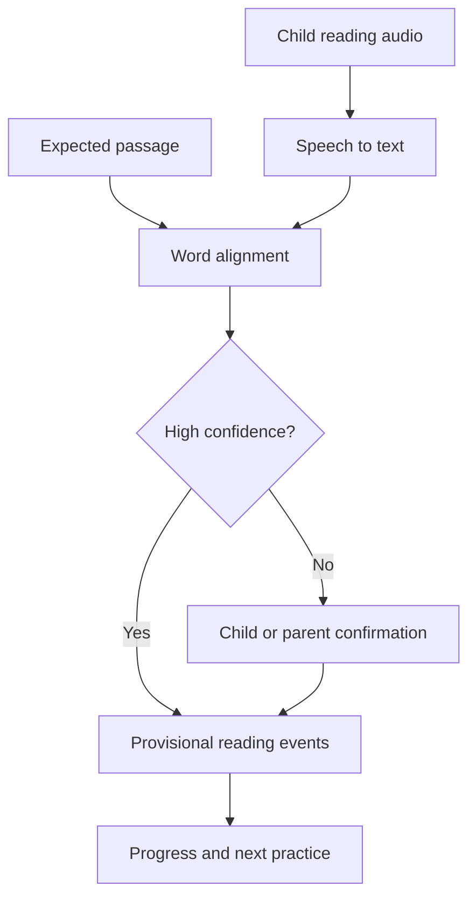
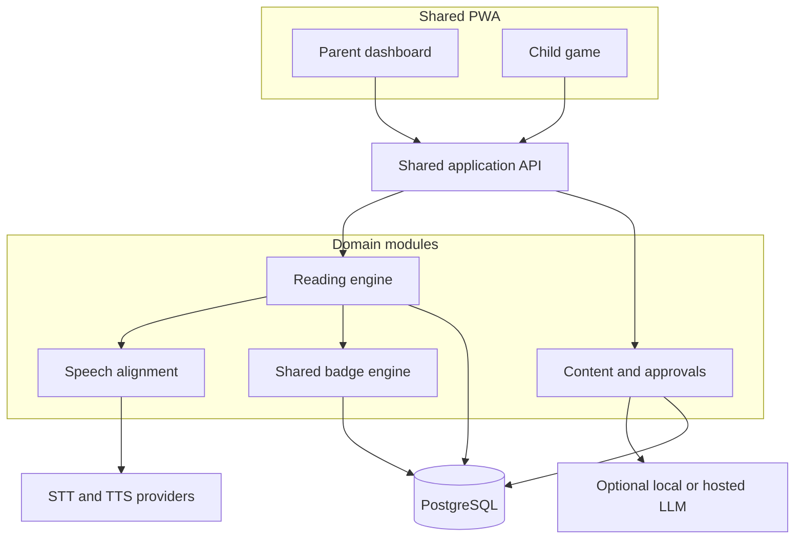

# Reading Quest Product Requirements and Delivery Plan

**Status:** Ready for developer handoff  
**Product type:** Companion module to Spelling Quest  
**Platform:** Responsive web app and installable PWA  
**Primary users:** Parent or guardian and child  
**Recommended audience:** Beginning through intermediate readers, configurable by skill level

## Executive summary

Reading Quest helps children become stronger readers through short daily sessions built from parent-provided word lists, sentences, passages, or books. It shares accounts, child profiles, progress infrastructure, speech integration, and badges with Spelling Quest.

The core loop is:

1. Preview a small set of words.
2. Hear and identify their sounds or parts.
3. Read the words aloud.
4. Read a sentence or short passage containing them.
5. Answer a few comprehension questions.
6. Re-read for improved accuracy and fluency.
7. Revisit difficult words and passages later.

Speech-to-text can help detect omissions and substitutions, but should not act as an infallible reading judge. The child or parent must be able to correct uncertain recognition. An LLM is useful for generating level-appropriate passages and questions, but generated material should be constrained, validated, and parent-approved before a child sees it.

## 1. Product vision

Turn assigned reading material and a child's current skill level into manageable, encouraging practice that develops decoding, accuracy, fluency, vocabulary, and comprehension.

### Goals

- Give parents a fast way to enter or select reading material.
- Keep normal sessions between 10 and 15 minutes.
- Provide support without immediately telling the child every word.
- Measure progress against the child's own earlier reading.
- Adapt review based on observed difficult words and comprehension gaps.
- Reuse the same child identity and badge collection as Spelling Quest.
- Make every activity usable without a microphone.

### Non-goals for MVP

- Diagnosing dyslexia or another learning condition.
- Replacing teachers, reading specialists, or formal assessments.
- Open-ended AI conversation with children.
- Automatically grading expression or accent as right or wrong.
- A marketplace of copyrighted books or passages.
- Classroom and district administration.

## 2. Reading modes

| Mode | Purpose | Best for |
|---|---|---|
| Word Quest | Decode and read individual words | Early readers and targeted weak-word practice |
| Sentence Quest | Read words in meaningful context | Developing phrasing and syntax |
| Story Quest | Read a short controlled passage | Fluency and comprehension |
| Book Quest | Track pages or chapters from a physical book | Independent reading and family routines |
| Listen and Follow | Hear text while words are highlighted | Modeling fluent reading |
| Read Again | Re-read a familiar passage and improve | Accuracy, confidence, and fluency |

The MVP should implement Word Quest, Sentence Quest, Story Quest, and Read Again. Book Quest may initially track title, page range, minutes, and a short parent-approved reflection without reproducing book text.

## 3. Learning model

### Skill dimensions

Track related abilities separately so a child is not labeled simply “good” or “bad” at reading.

| Dimension | What is observed | MVP evidence |
|---|---|---|
| Decoding | Ability to turn letter patterns into spoken words | Target-word attempts and requested hints |
| Accuracy | Correct words relative to attempted words | Confirmed omissions, substitutions, insertions, and self-corrections |
| Fluency | Smooth reading at an appropriate pace | Words correct per minute plus reread improvement; never speed alone |
| Vocabulary | Understanding important words | Matching, simple definitions, and contextual choices |
| Comprehension | Understanding literal and inferential meaning | Parent-approved questions and child responses |
| Confidence | Willingness to attempt and recover | Completion, retries, self-corrections, and optional child check-in |

### Passage progression

Each passage moves through four stages:

| Stage | Experience | Completion rule |
|---|---|---|
| Preview | See a few important or potentially difficult words | Child hears and practices selected words |
| Supported read | Read with optional tap-to-hear and visual tracking | Reading attempt completed; uncertain speech is reviewed |
| Meaning check | Answer two to five questions | Responses recorded with supportive correction |
| Reread | Read the same passage later with less help | Completed on a later attempt; improvement is shown privately |

### Word-help ladder

Hints should increase gradually rather than immediately revealing the word:

1. Wait and encourage another attempt.
2. Highlight the first letter or known word part.
3. Play the first sound or syllable.
4. Break the word into syllables or grapheme groups.
5. Speak the complete word.
6. Ask the child to repeat it and read the sentence again.

Record which hint level was needed. A word read after hearing the full answer counts as supported practice, not independent mastery.

## 4. Content sources

Parents can create reading work from:

- A pasted passage they have permission to use.
- Parent-written sentences or stories.
- A list of target words used to generate a passage.
- Public-domain or licensed content included with the app.
- A physical book record containing title and page range, without copying the book.
- A photo or document import in a later release.

### AI-generated content policy

The local LLM is valuable here, especially for generating decodable passages from target words. Generation should happen in the parent workflow, not live in the child session.

Required controls:

- Parent selects approximate reading level, passage length, topic, and target words.
- Prompt constrains vocabulary, sentence length, content, and requested phonics pattern.
- System performs automated checks for length, banned topics, target-word inclusion, and question-answer consistency.
- Parent sees and edits the complete passage, vocabulary, questions, and expected answers.
- Nothing is assigned until the parent approves it.
- Store the approved version as an immutable activity snapshot.
- Label generated material to the parent, but do not clutter the child's reading screen.

## 5. Functional requirements

| ID | Capability | Requirement | Priority |
|---|---|---|---|
| RR-1 | Shared profiles | Reuse family accounts, child profiles, accessibility preferences, and badge collection | Must |
| RR-2 | Reading library | Parent can create, edit, assign, archive, and reuse words, sentences, and passages | Must |
| RR-3 | Level settings | Parent can configure reading stage, text size, session length, and support level | Must |
| RR-4 | Word preview | System selects important words and supports sound, syllable, and word-part practice | Must |
| RR-5 | Read aloud | Child reads a word, sentence, or passage using voice or parent-assisted mode | Must |
| RR-6 | Reading alignment | System aligns recognized speech with expected text and flags uncertain differences | Must |
| RR-7 | Hint ladder | Child receives progressively stronger help and can hear any word | Must |
| RR-8 | Comprehension | System asks literal, sequencing, vocabulary, and simple inference questions | Must |
| RR-9 | Rereading | System schedules familiar passages and shows improvement without shaming | Must |
| RR-10 | Parent review | Parent can inspect and correct recognition results and generated content | Must |
| RR-11 | Progress | Dashboard reports activity, difficult words, comprehension, and reread improvement | Must |
| RR-12 | Badges | Shared system awards reading-specific mastery, effort, improvement, and resilience badges | Must |
| RR-13 | Passage generation | LLM proposes constrained passages and questions for parent approval | Should |
| RR-14 | Book tracking | Record physical book, page range, minutes, and reflection | Should |
| RR-15 | Camera import | OCR a worksheet or parent-owned passage for review | Could |

## 6. Child session flow

1. Show today's quest, estimated duration, and reward opportunity.
2. Warm up with two previously difficult words.
3. Preview three to eight important words from the new passage.
4. Let the child read each word and use the hint ladder if needed.
5. Display the sentence or passage with optional focus mode.
6. Record the child reading aloud or allow parent-assisted/manual mode.
7. Align recognized words with the expected text.
8. Ask the child or parent to confirm uncertain differences.
9. Ask two to five age-appropriate comprehension questions.
10. Retry one or two important missed words in context.
11. Show progress, any earned badge, and the next recommended activity.

### Focus mode

Offer display settings that reduce visual overload:

- One sentence or line at a time.
- Adjustable font size and line spacing.
- Optional reading ruler or line highlight.
- Optional word-by-word highlighting during modeled audio.
- Neutral typeface with an optional dyslexia-friendly alternative.
- Reduced animation and muted sound.
- High contrast without relying on color alone.

## 7. Voice and reading alignment

Reading evaluation is harder than spelling comparison. Speech recognition may miss quiet speech, child pronunciation, accents, pauses, and self-corrections. Treat the transcript as evidence requiring confidence-aware alignment, not unquestionable truth.



### Alignment event types

- `correct`
- `omission`
- `substitution`
- `insertion`
- `self_correction`
- `help_requested`
- `speech_uncertain`
- `parent_corrected`

### Scoring rules

- Do not penalize accent or dialect differences that preserve the intended word.
- Ignore harmless punctuation and timing differences.
- Count a self-corrected word separately from an uncorrected error.
- Exclude low-confidence regions from automatic negative scoring.
- A word supplied through the final hint level is supported, not independent.
- Fluency combines accuracy, appropriate phrasing, and improved comfort; it is not a race.
- Words-correct-per-minute may be shown to parents but should not dominate the child UI.

### Audio retention

Do not retain raw reading audio by default. When temporary audio is required for processing, encrypt it and delete it automatically. A parent may explicitly opt into keeping selected recordings for private progress comparison, with clear deletion controls.

## 8. Comprehension activities

Use a small number of questions after reading. Mix formats so the game measures meaning rather than test-taking tricks.

| Type | Example task | Automatic scoring |
|---|---|---|
| Literal | Identify a stated fact | Deterministic when answer options are approved |
| Sequence | Put three events in order | Deterministic |
| Vocabulary | Choose the meaning of a word in context | Deterministic with approved choices |
| Main idea | Select the best summary | Deterministic with parent-approved answer |
| Simple inference | Infer why a character acted | Deterministic for multiple choice; parent review for open response |
| Retell | Say what happened in the child's own words | Completion or parent review in MVP; no high-stakes LLM score |

Incorrect answers should point the child back to the relevant sentence before revealing the answer.

## 9. Reading badge catalog

Reading Quest shares the badge engine and collection with Spelling Quest. Reading badges use their own event criteria.

| Code | Badge | Criteria | Category | Tier |
|---|---|---|---|---|
| `READ_FIRST_WORD` | Sound Scout | Independently read the first target word | First steps | Bronze |
| `READ_FIRST_PASSAGE` | Story Starter | Complete the first passage | First steps | Bronze |
| `READ_100_WORDS` | Page Turner | Read 100 confirmed words | Effort | Bronze |
| `READ_500_WORDS` | Book Trekker | Read 500 confirmed words | Effort | Silver |
| `READ_1000_WORDS` | Reading Ranger | Read 1,000 confirmed words | Collection | Gold |
| `SELF_CORRECT_5` | Sharp Eyes | Self-correct five reading miscues | Resilience | Bronze |
| `HARD_WORD_10` | Word Breaker | Independently read 10 words previously requiring help | Improvement | Silver |
| `REREAD_BETTER` | Smoother Reader | Improve accuracy on a reread without using more help | Improvement | Silver |
| `COMPREHEND_5` | Meaning Maker | Correctly answer five comprehension questions | Comprehension | Bronze |
| `COMPREHEND_25` | Story Detective | Correctly answer 25 comprehension questions | Comprehension | Silver |
| `PERFECT_PASSAGE` | Clear Path | Complete an eligible passage with no uncorrected errors | Mastery | Gold |
| `THREE_READING_DAYS` | Reading Rhythm | Practice on three scheduled days in a school week | Consistency | Bronze |
| `BOOK_FINISH` | Book Finisher | Complete a parent-recorded book | Collection | Gold |

The same badge fairness rules apply: no removals, no public ranking, no rigid weekend streaks, idempotent awards, accessible celebrations, and parent controls.

## 10. Parent experience

### Create a reading quest

1. Choose words, sentences, passage, or physical book.
2. Paste approved text or enter target words.
3. Optionally ask the LLM to draft a passage.
4. Review and edit every generated component.
5. Select reading level, support level, and session length.
6. Choose comprehension question types.
7. Preview exactly what the child will see.
8. Assign immediately or schedule it.

### Progress dashboard

Show:

- Minutes and completed sessions.
- Independently read words.
- Words that repeatedly require help.
- Accuracy trend and reread improvement.
- Comprehension by question type.
- Self-corrections and successful retries.
- Speech-uncertain regions separately from confirmed errors.
- Earned reading and spelling badges in one collection.

Avoid a single permanent “reading level” score. Present evidence and trends, because performance varies by text, background knowledge, fatigue, and support.

## 11. Architecture

Reading Quest should be another domain module inside the existing modular monolith rather than a separate product stack.



### Reused components

- Authentication and family tenancy.
- Child profiles and preferences.
- PWA shell and child-safe navigation.
- Speech provider adapter and microphone capture.
- Session persistence and event ledger.
- Badge catalog, evaluator, collection, and celebrations.
- Parent dashboard layout.
- Privacy, export, deletion, monitoring, and backups.

### New domain components

- Reading content and approval workflow.
- Passage parser and word-position model.
- Transcript-to-passage alignment.
- Hint ladder and help-event tracking.
- Comprehension question engine.
- Reread scheduling and comparison.
- Physical book log.

## 12. Data model additions

| Entity | Important fields | Notes |
|---|---|---|
| `ReadingItem` | `id`, `family_id`, `type`, `title`, `source`, `status`, `created_by` | Parent-owned content record |
| `ReadingVersion` | `id`, `item_id`, `text`, `level_config`, `approval_status`, `created_at` | Immutable approved activity snapshot |
| `TargetWord` | `version_id`, `word`, `position`, `phonics_tags`, `priority` | Drives preview and word review |
| `ReadingAssignment` | `id`, `child_id`, `version_id`, `scheduled_at`, `status` | Connects approved content to a child |
| `ReadingSession` | `id`, `assignment_id`, `started_at`, `completed_at`, `mode` | One reading attempt or reread |
| `ReadingEvent` | `session_id`, `token_position`, `event_type`, `observed_text`, `confidence`, `hint_level` | Detailed aligned evidence |
| `Question` | `version_id`, `type`, `prompt`, `choices`, `expected_answer`, `source_span` | Must be approved with the passage |
| `QuestionAttempt` | `session_id`, `question_id`, `response`, `result`, `support_used` | Comprehension evidence |
| `BookLog` | `child_id`, `title`, `author`, `start_date`, `finish_date`, `page_progress` | Does not store copyrighted book text |

## 13. API additions

| Method and route | Purpose |
|---|---|
| `POST /reading-items` | Create a word set, passage, or book record |
| `POST /reading-items/{id}/generate` | Request a parent-facing passage draft from target words |
| `POST /reading-versions/{id}/approve` | Freeze and approve content for child assignment |
| `POST /reading-assignments` | Assign approved material to a child |
| `GET /children/{id}/reading/today` | Return today's reading plan |
| `POST /reading-sessions` | Start a reading session |
| `POST /reading-sessions/{id}/audio` | Transcribe and align a short passage segment |
| `POST /reading-sessions/{id}/events` | Confirm or correct aligned reading events |
| `POST /reading-sessions/{id}/answers` | Record comprehension responses |
| `POST /reading-sessions/{id}/complete` | Finalize progress, scheduling, and badges |
| `GET /children/{id}/reading/progress` | Return reading dashboard evidence and trends |

## 14. Nonfunctional requirements

| Area | MVP target |
|---|---|
| Performance | Passage screen loads within two seconds at p95 |
| Speech latency | Process a short sentence segment within four seconds at p95 |
| Accessibility | Keyboard and touch support, scalable text, visible audio equivalents, reduced motion, no color-only meaning |
| Reliability | Manual or parent-assisted mode remains usable when speech services fail |
| Privacy | No raw audio retention by default; approved content and child data remain within family tenancy |
| Testing | Unit tests for alignment and progression; integration tests for tenancy; end-to-end tests for core reading flows |
| Content safety | All generated child content is approved and versioned before assignment |

## 15. Success metrics

| Metric | Initial target |
|---|---|
| Quest completion | At least 75% of started sessions completed |
| Weekly use | At least three completed reading sessions per active child |
| Reread improvement | Majority of eligible rereads improve accuracy or require less help |
| Recognition correction | Fewer than 5% of confident automatic events are corrected by a parent |
| Comprehension growth | Improvement over time within comparable question types and passage levels |
| Hint independence | Previously supported words increasingly read with lower hint levels |
| Parent content approval | At least 80% of started reading assignments reach approval and assignment |

## 16. Epics breakdown

### Epic R1: Shared platform integration

**Outcome:** Reading Quest appears as a first-class activity within the existing family product.

- Reuse authentication, tenancy, child profiles, navigation, preferences, sessions, and event infrastructure.
- Add reading feature flags and domain permissions.
- Add shared home screen entry and unified activity history.

Acceptance criteria:

- Existing children can enter Reading Quest without a new account.
- Reading and spelling data remain logically separate but share family security boundaries.
- Disabling Reading Quest does not affect Spelling Quest.

### Epic R2: Reading content and approval

**Outcome:** Parents can create safe, versioned reading assignments.

- Build word, sentence, passage, and book entry forms.
- Add passage preview and target-word selection.
- Add draft, approved, assigned, and archived states.
- Freeze approved versions.
- Add reuse and duplication.

Acceptance criteria:

- A parent can paste, preview, approve, assign, and reopen a passage.
- Child sessions always use the approved snapshot.
- Editing approved content creates a new version.

### Epic R3: Reading session experience

**Outcome:** A child can complete preview, reading, meaning check, and reread activities.

- Build child reading home and session shell.
- Implement focus mode and display settings.
- Add target-word preview.
- Add supported read and tap-to-hear.
- Add completion and resume.

Acceptance criteria:

- A complete session works without microphone access.
- Text scaling and line focus work without clipping or horizontal scrolling.
- A refresh does not lose confirmed progress.

### Epic R4: Speech alignment and review

**Outcome:** Spoken reading produces useful, confidence-aware evidence.

- Extend microphone capture for passage segments.
- Implement transcript-to-expected-text alignment.
- Classify omissions, substitutions, insertions, and self-corrections.
- Add uncertainty confirmation and parent correction.
- Add manual reading-observation mode.

Acceptance criteria:

- Alignment tests cover repeated words, skipped lines, restarts, and self-corrections.
- Low-confidence regions do not become automatic errors.
- Parent correction preserves the original machine result for audit.

### Epic R5: Hints and difficult-word practice

**Outcome:** Children receive graduated support and later practice the words that needed it.

- Implement the hint ladder.
- Record hint level and supplied answers.
- Extract difficult words from confirmed events.
- Schedule word review and contextual retry.

Acceptance criteria:

- A fully supplied word is not counted as independently read.
- Previously difficult words return in future sessions.
- Lower hint use is represented as improvement.

### Epic R6: Comprehension

**Outcome:** The game verifies that the child understood the text.

- Implement literal, sequence, vocabulary, main-idea, and inference questions.
- Link questions to supporting passage spans.
- Return the child to relevant text after an incorrect response.
- Add parent-reviewed retell mode.

Acceptance criteria:

- Every automatic question has one approved expected answer.
- Incorrect feedback explains where to look without immediately giving the answer.
- Open responses are not assigned a high-stakes automated score.

### Epic R7: Rereading and progression

**Outcome:** The system schedules useful rereads and shows improvement fairly.

- Implement passage eligibility and due dates.
- Compare accuracy, hint use, self-correction, and comfortable pacing.
- Select a balanced daily plan.
- Avoid repeating mastered passages excessively.

Acceptance criteria:

- A reread occurs in a later session, not immediately after first exposure.
- Improvement does not depend solely on reading faster.
- Missed practice days do not create an excessive session.

### Epic R8: Reading progress dashboard

**Outcome:** Parents see actionable evidence rather than one reductive score.

- Show sessions, minutes, word evidence, comprehension, rereads, and trends.
- Separate confirmed errors from speech uncertainty.
- Show recurring difficult words and recommended practice.
- Add filters by date, content, and skill dimension.

Acceptance criteria:

- Dashboard figures reconcile with confirmed events.
- Parent can trace a summary value to its source sessions.
- The UI explains that results vary by passage and support level.

### Epic R9: Reading badges

**Outcome:** Reading activities award badges through the shared reward engine.

- Add reading event types to the reward ledger.
- Add the initial reading badge catalog.
- Add criteria, replay, and idempotency tests.
- Display reading and spelling badges in a unified collection with filters.

Acceptance criteria:

- The same event cannot award the same badge twice.
- Supported and independent reading are distinguished correctly.
- Speech corrections can count when the child actually read the word correctly.

### Epic R10: AI-assisted content generation

**Outcome:** Parents can quickly create controlled reading material from target skills and interests.

- Define structured generation inputs and outputs.
- Integrate a local or hosted LLM through an adapter.
- Add vocabulary, length, topic, and phonics constraints.
- Validate target-word inclusion and question-answer consistency.
- Build full parent edit and approval workflow.

Acceptance criteria:

- Generated content never reaches the child before approval.
- Generation failure does not block manual content creation.
- Approved versions remain unchanged when models or prompts change.

### Epic R11: Privacy, accessibility, and release readiness

**Outcome:** Reading Quest is safe and operable for invited families.

- Add retention, export, and deletion controls.
- Add tenant-isolation and content-authorization tests.
- Complete screen-reader, keyboard, text-scaling, and reduced-motion testing.
- Add speech and generation monitoring without unnecessary child data.
- Add backups and recovery documentation.

## 17. Suggested implementation slices

| Slice | Deliverable | Dependencies |
|---|---|---|
| 1. Manual reading skeleton | Parent pastes and approves a passage; child reads manually and answers two questions | R1–R3 and thin R6 |
| 2. Target words and hints | Preview, hint ladder, difficult-word events, and later review | R5 |
| 3. Speech beta | Segment recording, STT alignment, confirmation, correction, and fallback | R4 |
| 4. Reread and progress | Scheduling, comparison, and parent dashboard | R7–R8 |
| 5. Reading badges | Initial catalog, shared evaluation, collection filters, and tests | R9 |
| 6. LLM content beta | Constrained generation, validation, editing, and approval | R10 |
| 7. Release hardening | Privacy, accessibility, monitoring, backups, and browser validation | R11 |

## 18. MVP acceptance criteria

- [ ] Existing child profiles can use Reading Quest without another account.
- [ ] Parent can create and approve a passage before assignment.
- [ ] Child can complete preview, supported reading, comprehension, and completion without a microphone.
- [ ] Hint use distinguishes supported from independent reading.
- [ ] Voice alignment identifies provisional word events and requests review when uncertain.
- [ ] Accent, dialect, pauses, and low confidence do not create automatic failures.
- [ ] Confirmed difficult words influence later practice.
- [ ] Parent can correct recognition without deleting the original event.
- [ ] Comprehension questions link back to relevant text.
- [ ] Reread improvement considers accuracy and support, not only speed.
- [ ] Reading badges are idempotent, accessible, and integrated into the shared collection.
- [ ] Generated material cannot reach a child without parent approval.
- [ ] Raw audio is not retained by default.
- [ ] Automated tests cover tenancy, alignment, hints, progression, questions, and badges.

## 19. Risks and mitigations

| Risk | Impact | Mitigation |
|---|---|---|
| Child speech recognition is inaccurate | False errors and frustration | Segment audio, use confidence thresholds, support confirmation, and preserve manual mode |
| Fluency becomes a speed contest | Rushing and reduced comprehension | Combine accuracy, support, phrasing, and comfort; keep speed secondary |
| Text is too hard | Child disengages | Parent level controls, passage preview, vocabulary checks, and adaptive hints |
| Hints create dependence | Child waits for the answer | Graduated ladder, short wait, track support, and celebrate increasing independence |
| LLM generates poor content | Unsafe or instructionally weak material | Structured constraints, automated validation, full parent approval, immutable versions |
| Copyrighted text is stored improperly | Legal and trust risk | Use licensed, public-domain, or user-authorized text; store book metadata without copying text |
| One score labels the child | Misleading or discouraging conclusions | Show multiple dimensions, context, and trends rather than a permanent level |

## 20. Developer handoff notes

### Recommended first milestone

Build a complete manual-mode passage session before adding speech. A parent pastes and approves a passage; the child previews target words, reads with parent observation, answers two deterministic questions, and completes the session. This validates the experience and data model without waiting for child-speech accuracy.

### First speech technical spike

Create a browser prototype that records children reading short, known passages. Evaluate at least two STT configurations against a human-confirmed transcript. Measure:

- Word-level precision and recall.
- Omission and substitution detection.
- Self-correction handling.
- Confidence calibration.
- Performance with pauses, restarts, quiet speech, and background noise.
- Latency for sentence-sized segments.
- Parent correction rate.

Choose the approach based on alignment usefulness and correction burden, not raw transcription benchmark scores.

### Suggested shared repository layout

```text
apps/
  web/
  api/
packages/
  spelling-engine/
  reading-engine/
  speech-adapter/
  reading-aligner/
  content-generation/
  badge-engine/
  contracts/
  ui/
infra/
  migrations/
  deployment/
docs/
  adr/
```

### Architecture decisions to record

- ADR-008: Reading Quest is a shared-platform domain, not a separate application.
- ADR-009: Speech results are provisional until confidence rules accept them.
- ADR-010: Fluency is not reduced to reading speed.
- ADR-011: Generated child content requires parent approval and versioning.
- ADR-012: Hint level is part of mastery evidence.
- ADR-013: Reading and spelling share badges but retain separate learning models.
- ADR-014: Raw reading audio is not retained by default.

### Definition of done

- Acceptance criteria are implemented and tested.
- Family authorization is verified for each new data path.
- Manual fallback exists for speech-dependent behavior.
- Child-visible content has an approval and provenance state.
- Keyboard, touch, screen-reader, text-scaling, and reduced-motion behavior are reviewed.
- Loading, empty, offline, denied-permission, retry, and provider-failure states are handled.
- Analytics serve a defined metric and contain no unnecessary child data.
- Migrations, operational documentation, and rollback procedures are included.

