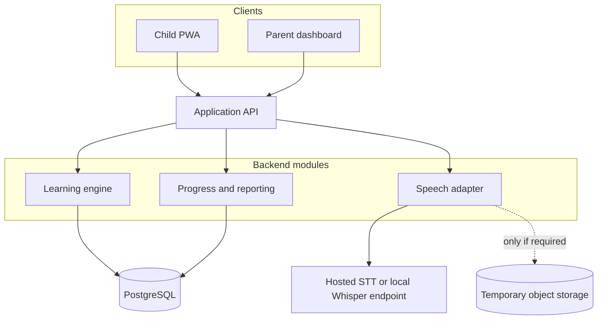
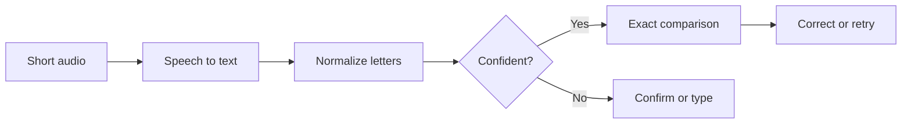
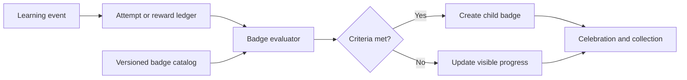

# Spelling Quest Product Requirements and Delivery Plan

**Status:** Ready for developer handoff  
**Product type:** Responsive web app and installable PWA  
**Primary users:** Parent or guardian and child  
**Recommended MVP:** Family-managed weekly spelling practice with voice and typed input

## Executive summary

Spelling Quest turns a school spelling list into short, progressively harder practice sessions. A parent enters a weekly list once. The app introduces part of the list each day, revisits weak words, and guides each child through a consistent sequence:

1. See the word.
2. Hear and say the word.
3. Spell it aloud while the word is visible.
4. Write it 10 times.
5. Spell it from memory without seeing it.
6. Revisit missed words later using spaced repetition.

Voice should use speech-to-text followed by deterministic letter comparison. An LLM is not required to decide whether an answer is correct. A local or hosted LLM may later provide parent-approved example sentences, hints, or encouragement, but it should not sit in the scoring path.

## 1. Product vision

Help children master teacher-assigned spelling words through predictable, game-like repetition that emphasizes active recall rather than recognition.

### Goals

- Make weekly list setup take less than two minutes.
- Keep a normal child session between 8 and 15 minutes.
- Introduce words gradually through the week.
- Require active recall instead of multiple-choice recognition.
- Make voice useful without allowing recognition errors to frustrate the child.
- Show parents which words are mastered, developing, or need attention.
- Keep the experience encouraging, private, and free of ads and public social features.

### Non-goals for MVP

- Replacing a teacher or formal educational assessment.
- General-purpose AI tutoring or open-ended child chat.
- Camera-based handwriting recognition.
- School district roster integrations.
- Classroom or public leaderboards.
- Native iOS and Android apps before validating the PWA.

## 2. Users and jobs to be done

| User | Primary need | Success signal |
|---|---|---|
| Parent or guardian | Create child profiles, enter lists, set test dates, and view progress | Setup is fast and the next action is obvious |
| Child | Complete a short, varied session and improve recall without feeling punished | Sessions are completed and blind-spelling accuracy improves |
| Teacher, future | Share lists and inspect class progress without managing family accounts | Deferred until the family workflow is proven |

### Representative user stories

- As a parent, I can paste one word per line instead of entering words individually.
- As a parent, I can accept an automatic daily rollout or choose how many new words appear each day.
- As a parent, I can see whether an error came from the child or uncertain speech recognition.
- As a child, I see one clear instruction at a time.
- As a child, I can hear the word again whenever needed.
- As a child, I can tap a microphone and spell a word aloud letter by letter.
- As a child, I can type my answer if voice recognition does not understand me.
- As a parent, I can review progress without listening to stored recordings.

## 3. Learning model

Each word moves through four stages. Progress depends on completed practice and recall performance, not merely the date.

| Stage | Child experience | Completion rule |
|---|---|---|
| Introduce | Word is visible and spoken aloud | Child views the word and confirms readiness |
| Say | Child says the word, then spells it aloud while visible | Speech is accepted, confirmed, or completed through typed fallback |
| Write | Child writes the visible word 10 times on paper or in an input field | Ten repetitions are checked off; typed repetitions may be validated |
| Recall | Word is hidden, spoken by the app, and answered aloud or by typing | Two correct blind attempts in separate sessions mark initial mastery |

### Default weekly progression

| Day | New material | Review emphasis |
|---|---|---|
| Day 1 | First 25% of list | Introduce, say, and write |
| Day 2 | Next 25% | Recall Day 1 words and practice new words |
| Day 3 | Next 25% | Mix mastered and developing words |
| Day 4 | Final 25% | Focus weak words and complete list coverage |
| Day 5 | No required new words | Simulated test and targeted retry |

The percentages are defaults. The scheduler rounds sensibly for small lists, honors the test date, and lets the parent change the pace. Missed days redistribute remaining words while respecting a maximum session duration.

### MVP mastery rules

- Record attempts as `correct`, `incorrect`, `skipped`, or `speech_uncertain`.
- Give blind recall more weight than visible practice.
- Repeat an incorrect word during the same session after at least two intervening words.
- Schedule developing words in the next session.
- Occasionally review mastered words for retention.
- Never mark an answer wrong solely because speech confidence is low.
- Mark a word initially mastered after two correct blind recalls in separate sessions.
- Allow the exact thresholds to be configuration rather than hard-coded UI behavior.

## 4. Functional requirements

| ID | Capability | Requirement | Priority |
|---|---|---|---|
| FR-1 | Accounts and profiles | Parent can sign in and create multiple child profiles with display name, grade band, and preferences | Must |
| FR-2 | Word lists | Parent can paste, add, edit, reorder, archive, and reuse lists; duplicates and empty entries are flagged | Must |
| FR-3 | Scheduling | Parent chooses start date, test date, practice days, and optional new-word count | Must |
| FR-4 | Session builder | System selects new, review, and weak words using the progression rules | Must |
| FR-5 | See and hear | Child sees a large word and can hear the word, letters, and instructions | Must |
| FR-6 | Spoken spelling | Child records a short utterance; the system extracts letters and compares them with the target | Must |
| FR-7 | Writing practice | System guides 10 repetitions and prevents accidental double counting | Must |
| FR-8 | Blind recall | Word is hidden; child hears it and answers by voice or keyboard | Must |
| FR-9 | Feedback | Feedback is immediate, brief, encouraging, and reveals the correct spelling after an error | Must |
| FR-10 | Progress | Parent sees per-word status, accuracy, attempts, and test readiness | Must |
| FR-11 | Badges and rewards | Child earns visible badges for mastery, effort, improvement, and consistency without purchases or public ranking | Must |
| FR-12 | Smart import | Photo OCR and teacher-shared list links accelerate list entry | Could |

## 5. Child session flow

1. Select a child profile and show today's estimated duration.
2. Warm up with one or two previously mastered words.
3. Present each new word in large text and speak it aloud.
4. Ask the child to say the word.
5. Ask the child to spell it aloud while the word remains visible.
6. Guide 10 written repetitions with a tap or Enter after each one.
7. Hide the word, speak it, and collect a blind voice or typed answer.
8. Mix recall questions so list order cannot be memorized.
9. Reinsert missed words later in the session.
10. End with stars earned, words strengthened, and one clear next-session message.

### Voice behavior

The app prompts for letter-by-letter spelling because general speech recognizers may interpret letter sequences as words or acronyms.

| Input condition | System behavior |
|---|---|
| “C A T” | Remove spaces and punctuation, normalize case, and compare `CAT` with the target |
| “C as in cat, A, T” | Optionally remove phonetic filler and produce `CAT` when unambiguous |
| Low-confidence “B” versus “D” | Display the interpreted letters and ask the child to confirm or type |
| Background noise or timeout | Offer **Try again** and **Type it** without scoring a failure |
| Microphone denied | Continue the entire session with keyboard input |

### Writing 10 times

The MVP should support two modes:

- **Paper mode:** show the word and 10 large check circles. The child writes on paper and taps once after each repetition.
- **Typed mode:** provide 10 short input rows and validate each entry against the visible word.

Stylus handwriting and handwriting recognition can be evaluated later. They add complexity without being necessary to validate the learning loop.

## 6. Parent experience

### Create a weekly list

1. Enter a title such as `Week of September 14`.
2. Paste words separated by lines or commas.
3. Review duplicates, whitespace, capitalization, and optional definitions or sentences.
4. Choose the child, first practice day, and test date.
5. Preview the proposed daily rollout.
6. Save and optionally begin the first session.

### Progress dashboard

Show:

- Overall test readiness.
- Sessions completed this week.
- Words by status: new, learning, developing, and mastered.
- Blind recall accuracy.
- Attempts and recent trend for each word.
- Speech uncertainty separately from spelling errors.
- Suggested extra-practice words.

Allow the parent to mark a speech attempt correct, reset a word, adjust pacing, and start an extra practice session.

## 7. Recommended architecture

Use a modular monolith for the MVP: one deployable backend with internal modules for accounts, lists, sessions, learning rules, speech, and reports. It reduces operational overhead while preserving clean boundaries that can become services later.



### Components

| Component | Responsibility | Suggested implementation |
|---|---|---|
| Web client | Parent dashboard, child game, microphone capture, offline shell, accessibility | React or Next.js PWA with TypeScript |
| Application API | Authentication, validation, authorization, session orchestration, reporting | TypeScript with NestJS or Next.js API, or Python FastAPI |
| Learning engine | Daily selection, retry spacing, stage transitions, mastery score | Pure domain module with deterministic unit tests |
| Speech adapter | Audio contract, provider calls, normalization, confidence handling | Pluggable provider interface |
| Database | Families, profiles, lists, schedules, attempts, progress, rewards | PostgreSQL with migrations and an ORM |
| Object storage | Temporary audio only when required by the speech provider | Encrypted objects with automatic short expiration |
| Background jobs | Optional transcription, report aggregation, and reminders | Queue-backed worker; may be in-process for MVP |

### Why an LLM is not the primary voice component

Scoring a spelling answer is an exact comparison problem. The correct pipeline is:



An LLM may be added behind a feature flag for:

- Parent-approved example sentences.
- Age-appropriate hints.
- Interpreting phrases such as “B as in boy” when deterministic parsing fails.
- Generating encouraging but constrained feedback.

An LLM should not override exact comparison or autonomously chat with the child.

## 8. Data model

| Entity | Important fields | Notes |
|---|---|---|
| `Family` | `id`, `owner_user_id`, `timezone` | Security boundary for all child data |
| `ChildProfile` | `id`, `family_id`, `display_name`, `grade_band`, `preferences` | No public profile or discoverability |
| `WordList` | `id`, `child_id`, `title`, `start_date`, `test_date`, `status` | One active weekly list per child is a simple default |
| `Word` | `id`, `list_id`, `text`, `sentence`, `position` | Preserve teacher spelling and display case |
| `WordProgress` | `child_id`, `word_id`, `stage`, `mastery_score`, `next_due_at` | Can be rebuilt from attempts if necessary |
| `PracticeSession` | `id`, `child_id`, `started_at`, `ended_at`, `plan_snapshot` | Snapshot makes session behavior auditable |
| `Attempt` | `session_id`, `word_id`, `mode`, `response`, `result`, `confidence`, `timestamp` | Modes include visible voice, writing, blind voice, and blind typed |
| `RewardLedger` | `child_id`, `event_type`, `points`, `metadata` | Append-only to prevent reward drift |
| `BadgeDefinition` | `id`, `code`, `name`, `description`, `category`, `tier`, `icon_key`, `criteria`, `is_secret` | Versioned catalog of earnable badges |
| `ChildBadge` | `child_id`, `badge_id`, `earned_at`, `progress`, `source_event_id` | Unique child-badge pair prevents duplicate awards |

## 9. API outline

| Method and route | Purpose |
|---|---|
| `POST /auth/session` | Create a parent session |
| `GET /children` | List family child profiles |
| `POST /children` | Create a child profile |
| `POST /word-lists` | Create and schedule a list |
| `PATCH /word-lists/{id}` | Edit metadata or words |
| `GET /children/{id}/today` | Return today's generated practice plan |
| `POST /practice-sessions` | Start a session and freeze its word order |
| `POST /practice-sessions/{id}/attempts` | Record a voice, typed, or writing attempt |
| `POST /speech/transcribe` | Return transcript, normalized letters, and confidence |
| `POST /practice-sessions/{id}/complete` | Finalize a session and update progress |
| `GET /children/{id}/progress` | Return parent dashboard summary and word detail |
| `GET /children/{id}/badges` | Return earned badges and progress toward visible badges |
| `GET /badges` | Return the active badge catalog and display metadata |

## 10. Security, privacy, and child safety

- Use parent-controlled accounts; children do not need email addresses.
- Collect the minimum personal data required.
- Prefer display names over full legal names.
- Do not retain raw microphone audio by default.
- If temporary audio retention is technically necessary, encrypt it and delete it automatically within a short documented window.
- Do not send child speech to an LLM when deterministic STT and parsing are sufficient.
- Enforce family tenancy and authorization in every server-side query.
- Give parents export and deletion controls.
- Avoid ads, behavioral profiling, public profiles, third-party tracking, and open chat.
- Obtain legal review before broadly marketing to children or schools. COPPA and state student-privacy requirements depend on the product's actual operation and audience.

## 11. Nonfunctional requirements

| Area | MVP target |
|---|---|
| Performance | Normal actions feel immediate; today's plan loads within 2 seconds at p95 on a typical home connection |
| Speech latency | Short-utterance result within 3 seconds at p95 |
| Availability | 99.5% monthly target after public release; typed fallback during speech outages |
| Accessibility | Keyboard operable, large touch targets, readable contrast, text equivalents, reduced-motion option |
| Compatibility | Current Chrome, Edge, Firefox, and Safari; tablet portrait and landscape |
| Observability | Structured logs, error tracking, request correlation, provider latency and errors; never log raw audio or secrets |
| Testing | Unit tests for learning and normalization, integration tests for authorization, end-to-end tests for core flows |

## 12. Success metrics

| Metric | Initial target |
|---|---|
| List setup completion | At least 80% of started lists are saved |
| Weekly engagement | At least four completed sessions per active child per school week |
| Session completion | At least 75% of started sessions are completed |
| Learning gain | Blind recall improves between the first attempt and final practice test |
| Speech fallback rate | Fewer than 15% of voice attempts require typing or parent correction |
| False-negative rate | Fewer than 2% of scored voice attempts are overridden as correct |

## 12.1 Badge and reward system

Badges give children visible milestones without turning practice into a competition. The system should reward four different kinds of success: learning words, sustaining effort, recovering from mistakes, and building a healthy routine. This lets a child earn something meaningful even when a list is difficult.

### Design principles

- Reward behaviors the child controls, not only perfect scores.
- Never remove an earned badge because of a later mistake or missed day.
- Avoid public rankings, scarcity, random purchases, loot boxes, and pay-to-win mechanics.
- Do not compare siblings unless a parent explicitly chooses a private cooperative family goal in a later release.
- Keep celebrations short so they do not interrupt the learning rhythm.
- Reveal the exact criteria for normal badges; reserve only a few harmless badges as surprises.
- Award each badge once, while allowing a separate counter to continue increasing.
- Make every badge understandable from its name, icon, and one-sentence description.

### Badge categories

| Category | What it rewards | Example |
|---|---|---|
| First steps | Beginning and completing core activities | First word learned or first session completed |
| Mastery | Correct blind recall and full-list readiness | 10 words mastered or a perfect practice test |
| Effort | Completing practice even when answers are difficult | Writing 50 repetitions or finishing a challenging session |
| Improvement | Doing better than the child's own earlier result | Turning three missed words into correct recalls |
| Consistency | Returning across planned practice days | Practicing three scheduled days in one week |
| Resilience | Retrying after a mistake and succeeding | Correctly spelling a word after an earlier miss |
| Voice | Using spoken spelling successfully | Five accepted voice spellings |
| Collection | Long-term cumulative milestones | 100 total words mastered |

### Initial badge catalog

| Code | Badge | Criteria | Category | Tier |
|---|---|---|---|---|
| `FIRST_WORD` | Word Explorer | Complete the learning loop for the first word | First steps | Bronze |
| `FIRST_SESSION` | Quest Starter | Complete the first full practice session | First steps | Bronze |
| `WRITE_50` | Pencil Power | Complete 50 verified writing repetitions across sessions | Effort | Bronze |
| `VOICE_5` | Clear Speaker | Complete five accepted spoken-spelling attempts | Voice | Bronze |
| `MASTER_10` | Word Collector | Master 10 unique words | Mastery | Bronze |
| `MASTER_25` | Word Adventurer | Master 25 unique words | Mastery | Silver |
| `MASTER_50` | Word Champion | Master 50 unique words | Mastery | Gold |
| `MASTER_100` | Spelling Legend | Master 100 unique words | Collection | Platinum |
| `COMEBACK_1` | Great Comeback | Correctly recall a word after previously missing it | Resilience | Bronze |
| `COMEBACK_10` | Never Give Up | Make 10 successful comeback recalls | Resilience | Silver |
| `IMPROVE_WEEK` | Level Up | Improve final-test accuracy by at least 20 percentage points from the week's baseline | Improvement | Silver |
| `THREE_DAYS` | Steady Steps | Practice on three scheduled days during one school week | Consistency | Bronze |
| `FULL_WEEK` | Weekly Hero | Complete every scheduled practice day in a week | Consistency | Gold |
| `PERFECT_5` | Five-Star Finish | Get five consecutive blind recalls correct in one session | Mastery | Silver |
| `PERFECT_LIST` | List Master | Complete a practice test with every word correct | Mastery | Gold |
| `TOUGH_WORD` | Word Tamer | Master a word after three or more prior incorrect blind attempts | Resilience | Gold |

Thresholds should be configuration so they can be adjusted after observing real children. The system must count unique words for mastery badges so repeating one easy word cannot unlock the collection.

### Badge progress and presentation

The child home screen shows the three most recent badges and one optional “almost earned” badge. A badge collection screen groups earned and locked badges by category. Visible locked badges show a plain-language progress statement such as `7 of 10 words mastered`.

When a badge is earned:

1. Finish scoring and persist the triggering attempt.
2. Evaluate badge criteria idempotently.
3. Save the award with its triggering event.
4. Show a two-to-three-second celebration after the activity feedback.
5. Allow the child to dismiss or skip the animation.
6. Include the badge in the session-end summary.

### Badge evaluation architecture



Evaluate simple badges synchronously after the triggering attempt so feedback is immediate. Re-evaluate aggregate or weekly badges when a session completes. The award operation must be idempotent and enforce a unique constraint on `(child_id, badge_id)`.

### Anti-gaming and fairness rules

- Practice attempts marked as parent-assisted do not count toward blind-mastery badges.
- Manual corrections of speech-recognition errors may count because the child's spelling was correct.
- Repeated typed entries while the word is visible count toward writing effort but not recall mastery.
- Restarting or refreshing a session cannot duplicate an award.
- Consistency badges use scheduled practice days, not a rigid daily streak that punishes weekends, illness, or vacations.
- Perfect badges count only completed, unassisted blind-recall attempts.
- Parent-created custom practice can count toward effort but should not manufacture duplicate unique-word mastery.
- Badge criteria must produce the same result when events are replayed.

### Parent controls

Parents can:

- Turn celebrations and sounds on or off.
- Hide an individual badge if its theme does not motivate their child.
- See why and when a badge was awarded.
- Choose a calm or energetic celebration style.
- Disable “almost earned” prompts if they create pressure.

Parents cannot directly grant mastery badges in the MVP. A later release may support parent-created family rewards, but those should remain separate from evidence-based learning badges.

### Badge analytics

Track only aggregate product events needed to answer specific questions:

- Badge earned.
- Celebration viewed or skipped.
- Collection opened.
- Almost-earned prompt selected.
- Session continued or abandoned shortly after a badge event.

Do not create behavioral advertising profiles or send badge names tied to identifiable child data to third-party analytics.

## 13. Epics breakdown

### Epic E1: Foundation and family accounts

**Outcome:** A parent can securely manage child profiles within one family boundary.

Stories:

- Establish repository, environments, CI, database migrations, and error monitoring.
- Implement parent registration, login, logout, and password recovery.
- Create family tenancy and authorization middleware.
- Create, edit, and archive child profiles.
- Add grade band and accessibility preferences.

Acceptance criteria:

- Parent can sign in and create at least two child profiles.
- One family cannot retrieve or mutate another family's data.
- Authentication and authorization paths have integration tests.

### Epic E2: Weekly word list management

**Outcome:** A parent can create and schedule a clean weekly spelling list in under two minutes.

Stories:

- Create paste-first list editor accepting lines and commas.
- Normalize whitespace without changing intentional spelling or case.
- Detect duplicates and empty values.
- Support add, edit, remove, and reorder.
- Set start date, test date, practice days, and rollout preference.
- Archive, duplicate, and reuse a prior list.
- Preview the daily rollout.

Acceptance criteria:

- A 20-word list can be pasted, corrected, scheduled, saved, and reopened.
- Invalid dates and duplicate entries produce actionable messages.
- Editing a list with existing attempts preserves history safely.

### Epic E3: Learning engine

**Outcome:** The system produces a predictable daily plan that adapts to performance.

Stories:

- Implement stages and stage transitions.
- Divide new words over available practice days.
- Select warm-up, new, weak, and retention words.
- Reinsert missed words after intervening items.
- Calculate mastery and next due date.
- Handle missed days and maximum session length.
- Freeze each generated session as a plan snapshot.

Acceptance criteria:

- Given fixed dates and attempt history, tests produce the expected plan.
- Incorrect words return without appearing immediately again.
- A missed day does not create an unreasonably long session.
- Rule configuration changes do not alter sessions already started.

### Epic E4: Child game shell

**Outcome:** A child can complete a clear, appealing session on a tablet or laptop.

Stories:

- Build child home and today's-session launch.
- Build one-step activity layout with large controls.
- Add progress indication, pause, and resume.
- Add encouraging transitions and completion summary.
- Support muted audio and reduced motion.
- Preserve progress after refresh or temporary disconnection.

Acceptance criteria:

- A keyboard-only practice session works end to end.
- All essential controls work with touch and keyboard.
- Refreshing does not lose completed attempts.

### Epic E5: See, say, and write activities

**Outcome:** Every new word completes the required guided learning stages.

Stories:

- Present the word in large readable text.
- Speak the word through TTS with replay.
- Prompt the child to say the whole word.
- Prompt visible letter-by-letter spelling.
- Implement paper-mode 10-repetition tracker.
- Implement optional validated typed repetitions.

Acceptance criteria:

- A new word cannot reach recall without completing the configured guided steps.
- Ten repetitions cannot be accidentally incremented by a single double-tap.
- Audio instructions always have visible text equivalents.

### Epic E6: Blind spelling and voice

**Outcome:** Voice and typed answers use the same reliable scoring rules.

Stories:

- Implement microphone permission and device-selection UX.
- Record short push-to-talk audio.
- Define an STT provider interface.
- Integrate the first hosted or local STT provider.
- Normalize letters, punctuation, filler, and case.
- Add confidence thresholds and ambiguous-letter handling.
- Show interpreted letters before confirmation when uncertain.
- Implement retry and typed fallback.
- Record provider latency, uncertainty, and fallback metrics.

Acceptance criteria:

- Voice and typed candidates use the same exact comparison function.
- Low-confidence results are not marked wrong automatically.
- Denied microphone permission never blocks a session.
- Raw audio is not retained under the default configuration.

### Epic E7: Progress and parent controls

**Outcome:** A parent can understand readiness and intervene when needed.

Stories:

- Build weekly readiness summary.
- Show per-word status, accuracy, attempts, and trend.
- Separate spelling errors from speech-uncertain attempts.
- Allow manual correction of a misheard attempt.
- Add extra-practice and word-reset controls.
- Provide list and child history.

Acceptance criteria:

- Dashboard totals reconcile with stored attempts.
- Parent correction recalculates progress without deleting audit history.
- Weak words can be launched as a targeted session.

### Epic E8: Privacy, security, and operations

**Outcome:** The MVP can be safely operated for invited families.

Stories:

- Add rate limiting, secure headers, validation, and secret management.
- Add tenant-isolation tests.
- Implement account export and deletion.
- Configure audio retention and deletion.
- Add backups and a restore runbook.
- Add uptime, error, and speech-provider monitoring.
- Document vendors and data flows.
- Complete accessibility and browser testing.

Acceptance criteria:

- Security and privacy release checklist passes.
- Raw audio is absent after its configured expiration.
- A documented backup restoration is successfully tested.
- Core flows pass on supported browsers and screen sizes.

### Epic E9: Badges, motivation, and polish

**Outcome:** Children receive meaningful, durable recognition for mastery, effort, improvement, consistency, and resilience.

Stories:

- Create a versioned badge-definition catalog.
- Implement event-driven, idempotent badge evaluation.
- Add the initial badge catalog and tier presentation.
- Show immediate, dismissible badge celebrations.
- Build the badge collection and visible progress display.
- Add parent controls for sounds, celebrations, hidden badges, and almost-earned prompts.
- Add accessibility behavior for animation, color, sound, and screen readers.
- Add badge analytics without identifiable child data.

Acceptance criteria:

- The same event cannot award the same badge twice.
- Badges remain earned after later mistakes or missed practice days.
- Badge rules correctly distinguish visible practice, assisted answers, blind recall, and speech corrections.
- All initial catalog badges have automated criteria tests and replay tests.
- Reduced-motion mode replaces animation with a static acknowledgment.
- Badge meaning is never communicated through color alone.
- Parents can disable celebrations without disabling badge tracking.

### Epic E10: Smart import and enrichment

**Release:** Post-MVP

Stories:

- Import a photographed paper list with OCR.
- Suggest definitions and example sentences.
- Require parent approval for generated content.
- Create shareable teacher list links.
- Improve duplicate and likely-typo detection.

## 14. Suggested implementation slices

| Slice | Deliverable | Dependencies |
|---|---|---|
| 1. Walking skeleton | Parent creates a profile and list; child completes a typed single-word session; attempt persists | Thin portions of E1–E4 |
| 2. Complete learning loop | See, TTS, visible spelling, 10 writing checks, blind typed recall, daily progression | E3 and E5 |
| 3. Voice beta | Microphone flow, one STT provider, normalization, confirmation, fallback, metrics | E6 after typed scoring is stable |
| 4. Parent visibility | Dashboard, word history, correction, and extra practice | E7 |
| 5. Release hardening | Privacy controls, accessibility, monitoring, backups, and browser testing | E8 |
| 6. Badge release | Initial catalog, evaluator, collection, celebrations, parent controls, and replay tests | E9 |

## 15. MVP acceptance criteria

- [ ] Parent can create a child and schedule a list of 5 to 40 words.
- [ ] App divides the list across available practice days and supports manual pacing.
- [ ] A new word follows the see, say, write 10 times, and blind-recall sequence.
- [ ] Child can complete every scored activity without a microphone.
- [ ] Supported browsers can capture spoken letter sequences and produce normalized candidate answers.
- [ ] Low-confidence speech triggers confirmation or typed fallback rather than an incorrect mark.
- [ ] Incorrect words reappear later and influence the next session.
- [ ] Parent dashboard accurately reflects history and mastery.
- [ ] Parent can correct an incorrectly transcribed answer without erasing the original attempt.
- [ ] No raw audio is retained after processing under the default configuration.
- [ ] Automated tests cover authorization, scoring, progression, and normalization edge cases.
- [ ] Badge awards are idempotent, auditable, accessible, and covered by criteria replay tests.

## 16. Risks and mitigations

| Risk | Impact | Mitigation |
|---|---|---|
| Letter recognition is unreliable for children | Frustration and false failures | Push-to-talk, pacing guidance, confidence thresholds, confirmation, typed fallback, and parent override |
| Writing 10 times feels tedious | Child abandons session | Keep repetitions fast, show progress, allow paper mode, and use small nonblocking celebrations |
| Missed days create too much work | Session becomes overwhelming | Cap new words and duration; move lower-priority words forward |
| Rewards displace learning | Child optimizes points instead of spelling | Reward completion and improvement; avoid purchases, public competition, and infinite grinding |
| Generated content is unsuitable | Child sees inaccurate or inappropriate text | Keep generation optional, constrain it, filter it, and require parent approval |
| School adoption expands legal duties | Compliance and release risk | Launch family-first, minimize data, document vendors, and obtain counsel before school deployment |

## 17. Open product decisions and recommended defaults

| Decision | Recommended default | Revisit when |
|---|---|---|
| On-screen handwriting | Paper plus 10 check-offs; optional typed repetitions | Families demonstrate demand for stylus input |
| Speech deployment | Hosted STT behind an adapter; allow a local endpoint configuration | Cost, privacy, or offline needs justify local inference |
| LLM integration | Off by default; optional parent-approved sentences and hints | The core loop has measurable value |
| Child authentication | Parent selects a local profile; optional short PIN | Multi-device or school accounts are added |
| Monetization | No ads or purchases in the child loop | Retention and parent willingness to pay are understood |

## 18. Developer handoff notes

### Recommended first milestone

Prove the complete learning loop with typed input before integrating speech. Keep the learning engine and answer normalization as pure, independently tested functions. Record a plan snapshot at session start so later rule changes do not alter an in-progress session.

### Recommended first technical spike

Build a single browser page that:

1. Records up to five seconds of audio.
2. Accepts both adult and child speakers.
3. Sends letter sequences to the proposed STT provider.
4. Normalizes the transcript.
5. Measures exact-match accuracy, confidence, latency, and fallback frequency.

Test commonly confused letters including B, D, E, G, M, N, P, T, and V. Choose the speech provider based on child letter-sequence accuracy rather than general transcription benchmarks.

### Definition of done for each story

- Acceptance criteria are implemented and tested.
- Authorization and family isolation are verified for every new data access path.
- Keyboard, touch, and screen-reader behavior are reviewed for interactive screens.
- Analytics are tied to a defined product metric and contain no unnecessary child data.
- Loading, empty, error, offline, microphone-denied, and retry states are handled.
- Documentation and migrations are included.
- The change can be rolled back safely.

### Recommended repository modules

```text
apps/
  web/                 # Parent and child PWA
  api/                 # HTTP API and orchestration
packages/
  learning-engine/     # Pure scheduling and mastery rules
  answer-normalizer/   # Speech and typed answer normalization
  contracts/           # Shared API schemas and types
  ui/                  # Shared accessible components
infra/
  migrations/
  deployment/
docs/
  adr/                 # Architecture decision records
```

### Initial architecture decisions to record

- ADR-001: Responsive PWA before native mobile apps.
- ADR-002: Modular monolith for MVP.
- ADR-003: Exact deterministic scoring outside the LLM.
- ADR-004: Pluggable speech provider interface.
- ADR-005: No raw audio retention by default.
- ADR-006: Parent-owned accounts and child subprofiles.
- ADR-007: Immutable attempt history with auditable corrections.
